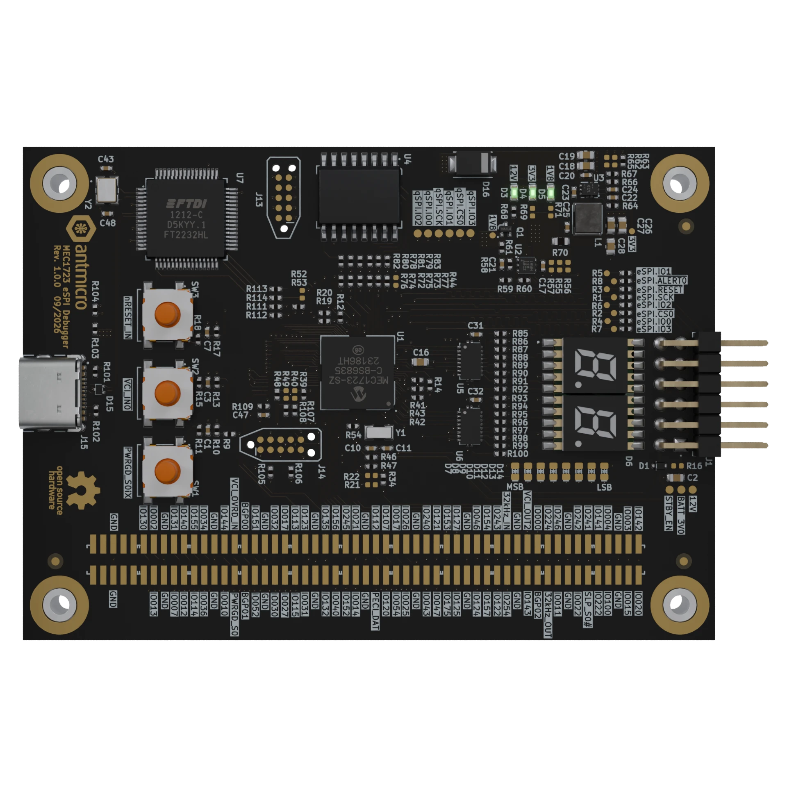

# MEC1723 eSPI Debugger

Copyright (c) 2026 [Antmicro](https://www.antmicro.com)

## Overview

This project contains open hardware design files for a debug board based on Microchip MEC1723 embedded controller which includes ARM Cortex-M4 core and eSPI physical interface.
The board is designed to aid development, bring-up and integration of eSPI-based data link between servers (HPMs) and Data Center Secure Control Modules (DC-SCMs).
The board has a 0.1 inch pin header connector which allows to connect it to the eSPI bus in the system under development.
The board provides USB-accessible UART and JTAG interfaces, Port 80 status display and local flash storage for the MEC1723 firmware.
MEC1723 controllers are supported in [Zephyr](https://www.zephyrproject.org/) RTOS

The PCB design files were prepared in KiCad 10.x.

## Key features

* Microchip [MEC1723](https://www.microchip.com/en-us/product/mec1723) embedded controller with ARM Cortex-M4 and eSPI interface
* Generic 0.1 inch pinhead connector
* USB-C port with FTDI FT2232H USB interface bridge
* UART and JTAG interfaces accessible from the USB interface bridge
* 1 Gb QSPI NOR Flash for MEC1723 firmware storage
* Port 80 (POST code) display with dual seven-segment LED indicator
* Tag-Connect headers for debug and programming access
* 62 x 87 mm (2.44 x 3.42 inch) PCB outline

## Project structure

The main directory contains KiCad PCB project files, the LICENSE, and this README, and the img directory contains graphics for this README.

## License

This project is licensed under the [Apache-2.0](LICENSE) license.
