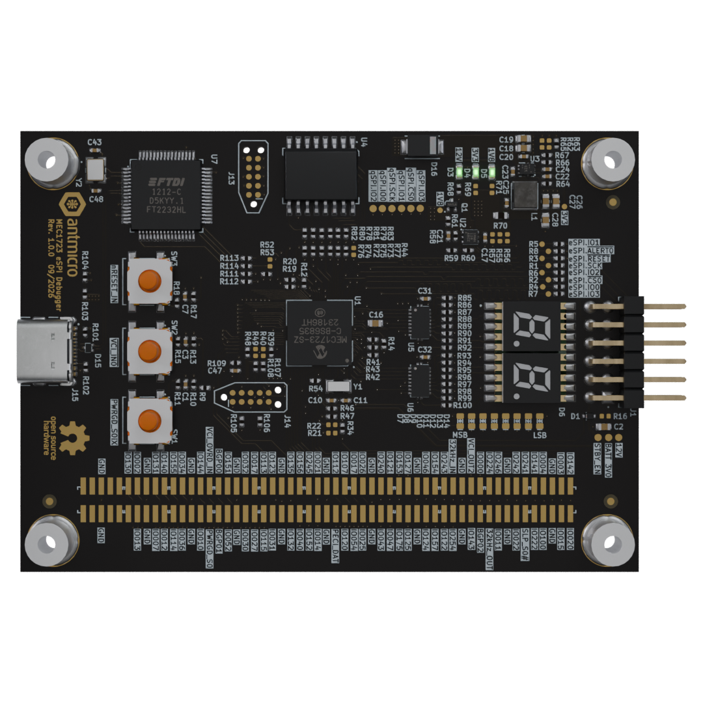

# MEC1723 eSPI Debugger

Copyright (c) 2026 [Antmicro](https://www.antmicro.com)

## Overview

This project contains open hardware design files for a debug board based on the Microchip MEC1723 Embedded Controller. The board is designed to aid development and bring-up of eSPI-based connections to Data Center Secure Control Modules (DC-SCMs).

The board connects to a DC-SCM interposer and provides USB-accessible UART and JTAG interfaces, Port 80 status display and local flash storage for the MEC1723 firmware. It can be used to develop, test and debug eSPI communication and related firmware before integrating the solution into a target server platform.

The PCB design files were prepared in KiCad 10.x.

## Key features

* Microchip [MEC1723](https://www.microchip.com/en-us/product/mec1723) Embedded Controller with eSPI interface
* DC-SCM interposer connector
* USB-C port with FTDI FT2232H USB interface bridge
* UART and JTAG interfaces accessible from the USB interface bridge
* 1 Gb QSPI NOR Flash for MEC1723 firmware storage
* Port 80 display with dual seven-segment LED indicator
* Tag-Connect headers for debug and programming access
* 62 x 87 mm (2.44 x 3.42 inch) PCB outline

## Project structure

The main directory contains KiCad PCB project files, the LICENSE, and this README, and the img directory contains graphics for this README.

## License

This project is licensed under the [Apache-2.0](LICENSE) license.
